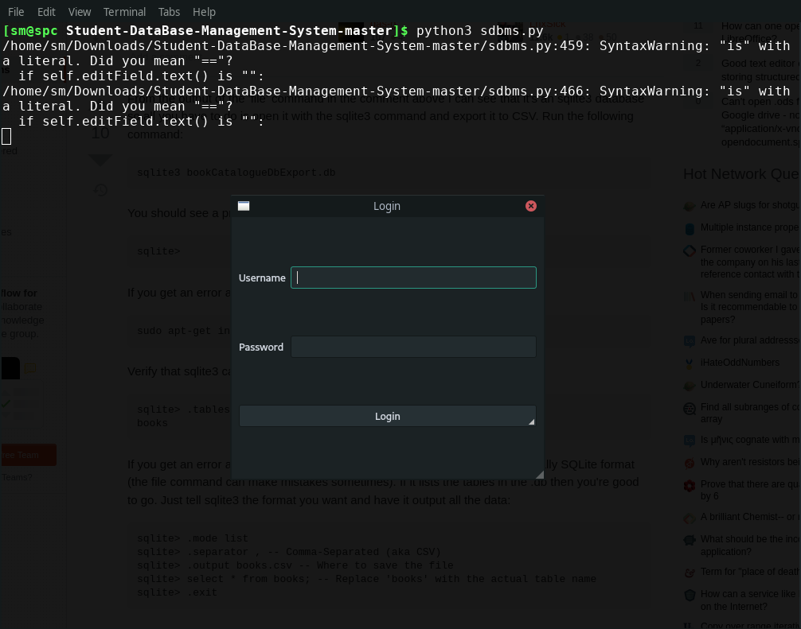
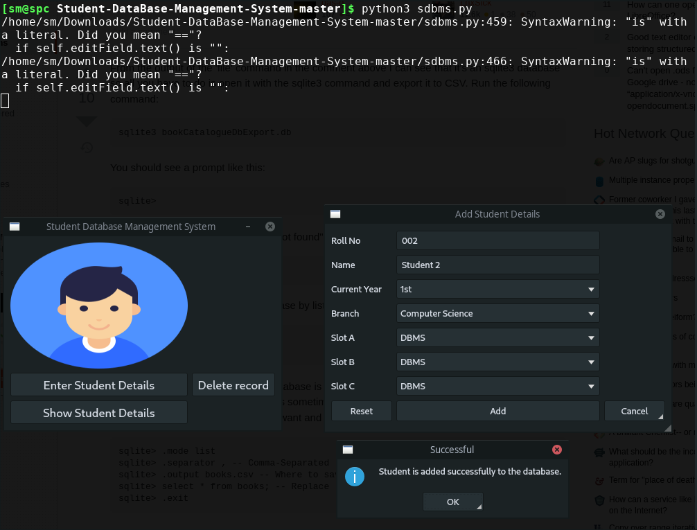
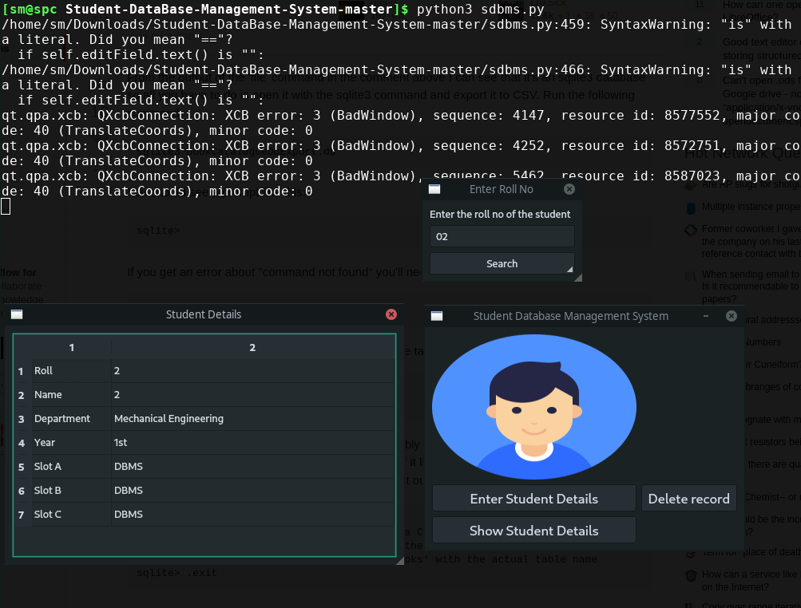
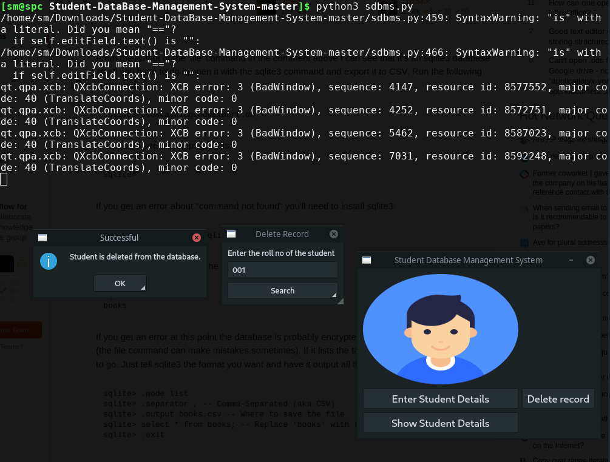

# Student-DataBase-Management-System Written in Qt5Core
# Elements used: 
+ QTableWidgetItem,QTableWidget,QComboBox,QVBoxLayout,QGridLayout,QDialog,QWidget,QPushButton, QApplication, QMainWindow,QAction,QMessageBox,QLabel,QTextEdit,QProgressBar,QLineEdit and QHBoxLayout.

## Screenshots
+ Login (username and password is set to default as blank)

+ Add a new student details

+ Show any student details (search by roll number)

+ Delete any student details
